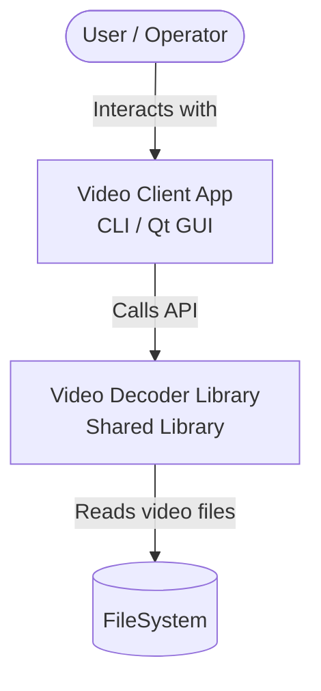
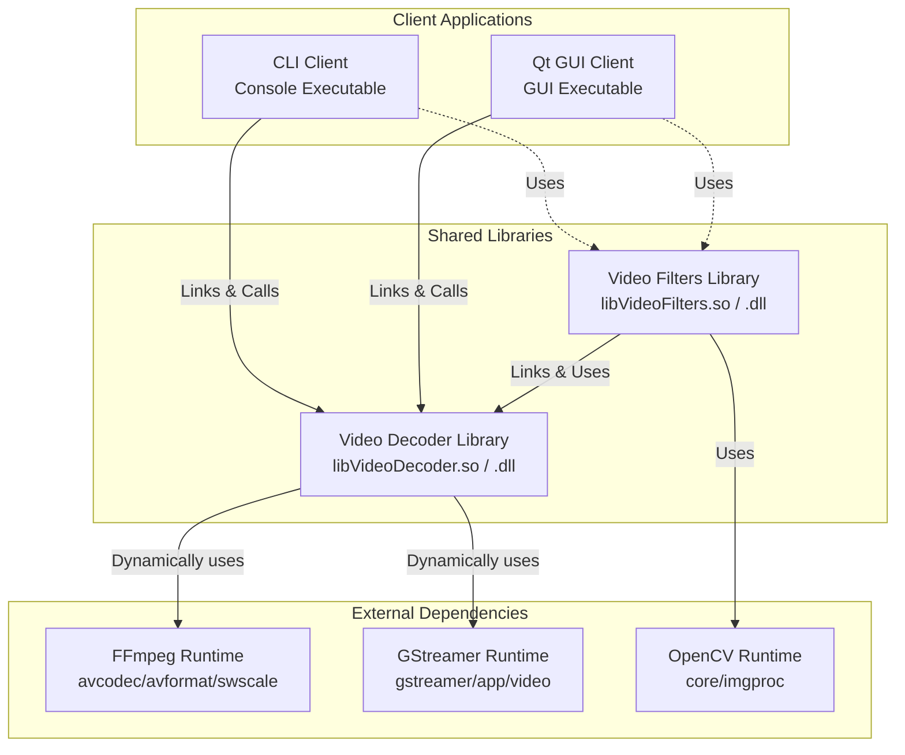
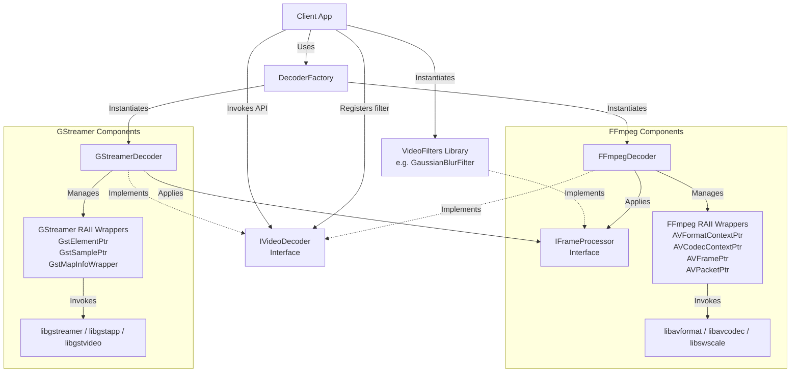
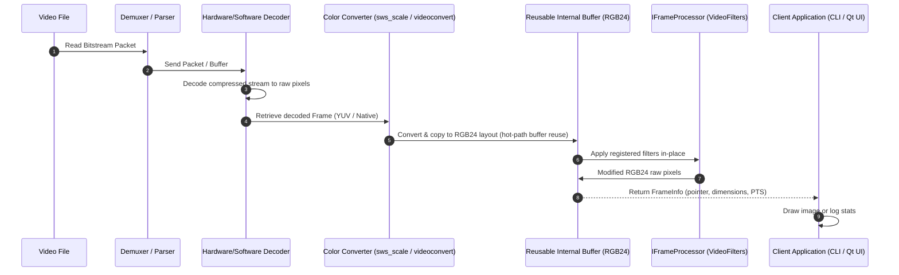

# Architecture Design: Video Decoder Solution

This document details the architectural design of the video decoding library and its companion client applications. The system follows the C4 model for software architecture, defining System Context, Container, and Component levels, followed by the video frame lifecycle diagram.

---

## 1. C4 Level 1: System Context

The System Context diagram describes the boundary of the Video Decoder Solution, the external filesystem from which video source data is loaded, and the final operator interacting with the CLI or Qt GUI.

### ASCII Diagram

```
+------------------+         Uses          +-----------------------+
|  User/Operator   |---------------------->| Video Client App      |
|                  |                       | (CLI or Qt GUI)       |
+------------------+                       +-----------+-----------+
                                                       |
                                                       | Calls API
                                                       v
+------------------+      Reads Video      +-----------------------+
|    FileSystem    |<----------------------| Video Decoder Library |
|  (Video Files)   |                       | (Shared Library)      |
+------------------+                       +-----------------------+
```

### Mermaid Diagram



---

## 2. C4 Level 2: Container Diagram

The Container diagram decomposes the system into runtimes: the Command Line Interface (CLI) client, the Qt GUI client, the core shared library, and the companion OpenCV-based filters shared library.

### ASCII Diagram

```
+-------------------------------------------------------------------------------+
| Video Decoder Solution System Boundary                                        |
|                                                                               |
|  +-----------------------+                         +-----------------------+  |
|  |      CLI Client       |                         |     Qt GUI Client     |  |
|  |  (Console Executable) |                         |   (GUI Executable)    |  |
|  +-----------+-----------+                         +-----------+-----------+  |
|              |                                                 |              |
|              | Links & Calls API                               | Links & Calls|
|              +------------------------+------------------------+              |
|                                       |                                       |
|                                       v                                       |
|                  +------------------------------------------+                 |
|                  |          Video Decoder Library           |                 |
|                  |             (Shared Library)             |                 |
|                  +--------------------+---------------------+                 |
|                                       ^                                       |
|                                       | Links                                 |
|                  +--------------------+---------------------+                 |
|                  |          Video Filters Library           |                 |
|                  |          (Shared Library w/ OpenCV)      |                 |
|                  +------------------------------------------+                 |
|                                       |                                       |
|                        +--------------+--------------+                        |
|                        |                             |                        |
|                        v                             v                        |
|             +---------------------+       +---------------------+             |
|             |   FFmpeg Backend    |       |  GStreamer Backend  |             |
|             |  (Shared Libraries) |       |  (Shared Libraries) |             |
|             +---------------------+       +---------------------+             |
|                                                                               |
+-------------------------------------------------------------------------------+
```

### Mermaid Diagram



---

## 3. C4 Level 3: Component Diagram

The Component diagram shows the internal structure of the `VideoDecoder` shared library, including interfaces, concrete backends, factory, and custom RAII wrappers.

### ASCII Diagram

```
+------------------------------------------------------------------------------------+
| Video Decoder Shared Library Component Boundary                                    |
|                                                                                    |
|                           +------------------------+                               |
|                           |      Client App        |                               |
|                           +-----------+------------+                               |
|                                       |                                            |
|                                       | Calls factory & uses interface             |
|                                       v                                            |
|                        +------------------------------+                            |
|                        |        IVideoDecoder         |                            |
|                        |     (Abstract Interface)     |                            |
|                        +--------------+---------------+                            |
|                                       ^                                            |
|                                       | Inherits                                   |
|                  +--------------------+--------------------+                       |
|                  |                                         |                       |
|       +----------+-----------+                  +----------+-----------+           |
|       |    FFmpegDecoder     |                  |   GStreamerDecoder   |           |
|       |  (Concrete Backend)  |                  |  (Concrete Backend)  |           |
|       +----------+-----------+                  +----------+-----------+           |
|                  |                                         |                       |
|                  | Uses RAII wrappers                      | Uses RAII wrappers    |
|                  v                                         v                       |
|  +---------------+---------------+         +---------------+---------------+       |
|  |  FFmpeg Custom RAII Wrappers  |         | GStreamer Custom RAII Wrappers|       |
|  | - AVFormatContextPtr          |         | - GstElementPtr               |       |
|  | - AVCodecContextPtr           |         | - GstSamplePtr                |       |
|  | - AVFramePtr                  |         | - GstBufferPtr                |       |
|  | - AVPacketPtr                 |         | - GstMapInfoWrapper           |       |
|  +---------------+---------------+         +---------------+---------------+       |
|                  |                                         |                       |
|                  v Links                                   v Links                 |
|       +----------------------+                  +----------------------+           |
|       |   FFmpeg Libraries   |                  | GStreamer Libraries  |           |
|       |  (avcodec/avformat/  |                  | (gstreamer/app/video) |           |
|       |   swscale/avutil)    |                  |                      |           |
|       +----------------------+                  +----------------------+           |
|                                                                                    |
+------------------------------------------------------------------------------------+
```

### Mermaid Diagram



---

## 4. Video Frame Lifecycle

This diagram demonstrates how raw and compressed frames flow through the decoder backends into the reusable internal memory, and finally to the client.

### ASCII Diagram

```
[ Video File ] 
      |
      | 1. Read Packet / Pull Buffer (av_read_frame / appsink sample)
      v
[ Compressed Stream Buffer ] (AVPacket or GstBuffer)
      |
      | 2. Submit to decoder pipeline (avcodec_send_packet / internal pipeline decode)
      v
[ Hardware / Software Decoder ]
      |
      | 3. Retrieve decoded frame (avcodec_receive_frame / appsink pull sample)
      v
[ Raw Decoded Frame ] (AVFrame in YUV420P / GstBuffer)
      |
      | 4. Color space convert & copy (sws_scale / GstMapInfo raw RGB copy)
      v
[ Reusable Internal Buffer ] (std::vector<uint8_t> in RGB24 format)
      |
      | 5. Apply registered frame processors in-place (IFrameProcessor::process)
      v
[ Processed Reusable Buffer ] (std::vector<uint8_t> in RGB24 format)
      |
      | 6. Bridge to Client via IVideoDecoder::getRawFrameData()
      v
[ Client Frame Reference ] (FrameInfo struct: raw pointer, width, height, PTS)
      |
      | 7. Render / Process (QImage construction & paintEvent / GL texture upload)
      v
[ Display Device ]
```

### Mermaid Diagram


